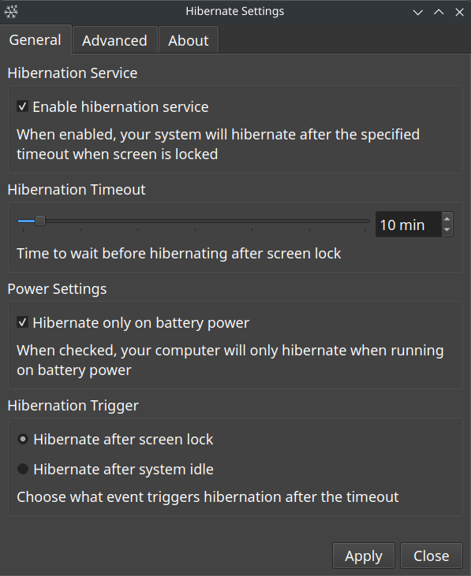
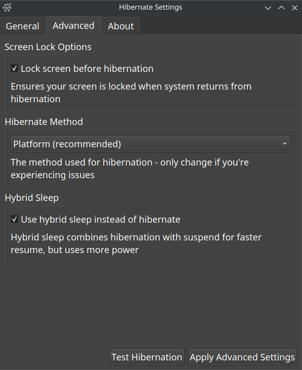
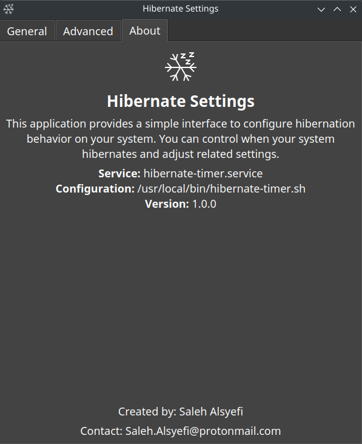

# Hibernate Settings GUI

A comprehensive Linux application that provides a graphical interface for managing system hibernation settings. This application allows you to control when your system hibernates, how it hibernates, and under what conditions hibernation is triggered.





## Compatibility

This application should work on:
- **Desktop Environments**: KDE, GNOME, Xfce, and others
- **Distributions**: Any Linux distribution that uses systemd (Arch, Ubuntu, Debian, Fedora, etc.)

The GUI is built with PyQt5 and integrates particularly well with KDE Plasma, but will work on other desktop environments too.

**Note**: Some advanced features might require distribution-specific adjustments. The application has been primarily tested on Arch Linux with KDE.

## Table of Contents

- [Features](#features)
- [Prerequisites](#prerequisites)
- [Installation](#installation)
  - [Automatic Installation](#automatic-installation)
  - [Manual Installation](#manual-installation)
- [Configuration Files](#configuration-files)
- [Hibernation Triggers](#hibernation-triggers)
- [Customizing Settings](#customizing-settings)
- [Authentication](#authentication)
- [Troubleshooting](#troubleshooting)
- [Technical Details](#technical-details)
- [Downloads](#downloads)
- [License](#license)

## Features

- **Enable/Disable Hibernation**: Toggle the hibernation service on or off
- **Timeout Setting**: Set how long to wait before hibernating (1-180 minutes)
- **Power Conditions**: Option to hibernate only when on battery power
- **Hibernation Triggers**: Choose between screen lock or system idle triggers
- **Advanced Settings**:
  - Hibernation methods (platform, shutdown)
  - Hybrid sleep option
  - Screen lock before hibernation
- **User-Friendly Interface**: Clean dark theme with readable text

## Prerequisites

The application requires the following components:

- Linux distribution with systemd (tested on Arch Linux)
- Python 3.6 or newer
- PyQt5
- systemd with hibernation capabilities
- polkit for privilege escalation

Install the dependencies on:
- **Arch Linux**:
  ```bash
  sudo pacman -S python python-pyqt5 xautolock
  ```

- **Ubuntu/Debian**:
  ```bash
  sudo apt install python3 python3-pyqt5 xautolock
  ```

- **Fedora**:
  ```bash
  sudo dnf install python3 python3-qt5 xautolock
  ```

## Installation

### Automatic Installation

1. Download the latest release from the [Releases page](https://github.com/alsyefs/hibernate-settings/releases)

2. Extract and install:
   ```bash
   tar -xf hibernate-settings-v1.0.0.tar.gz
   cd hibernate-settings
   chmod +x install.sh
   sudo ./install.sh
   ```

3. Launch the application from your application menu or run:
   ```bash
   hibernate-settings-gui
   ```

### Manual Installation

If you prefer to install manually, follow these steps:

1. Create the necessary script files:

   a. Create hibernation timer script:
   ```bash
   sudo nano /usr/local/bin/hibernate-timer.sh
   ```
   
   Paste the content from [hibernate-timer.sh](hibernate-timer.sh) and save.

   b. Make it executable:
   ```bash
   sudo chmod +x /usr/local/bin/hibernate-timer.sh
   ```

2. Install the GUI application:
   ```bash
   sudo cp hibernate-settings-gui /usr/local/bin/
   sudo chmod +x /usr/local/bin/hibernate-settings-gui
   ```

3. Create the systemd service:
   ```bash
   sudo nano /etc/systemd/system/hibernate-timer.service
   ```
   
   Paste this content:
   ```
   [Unit]
   Description=Screen lock hibernation service
   After=graphical.target

   [Service]
   ExecStart=/usr/local/bin/hibernate-timer.sh
   Restart=always
   User=YOUR_USERNAME

   [Install]
   WantedBy=graphical.target
   ```
   
   Replace `YOUR_USERNAME` with your actual username.

4. Install the desktop entry:
   ```bash
   sudo cp hibernate-settings.desktop /usr/share/applications/
   ```

5. Reload systemd daemon and enable the service:
   ```bash
   sudo systemctl daemon-reload
   sudo systemctl enable hibernate-timer.service
   sudo systemctl start hibernate-timer.service
   ```

## Configuration Files

The application manages several configuration files:

1. **Main hibernation script**: `/usr/local/bin/hibernate-timer.sh`
   - Contains the core logic for when to hibernate
   - Stores timeout, check interval, and battery-only settings

2. **Systemd service file**: `/etc/systemd/system/hibernate-timer.service`
   - Controls how the hibernation script runs
   - Specifies which user the service runs as

3. **Advanced Configuration**:
   - Hibernation method: `/etc/systemd/sleep.conf.d/99-hibernate-settings.conf`
   - Screen lock settings: `/etc/systemd/logind.conf.d/99-hibernate-settings.conf`

## Hibernation Triggers

The application supports two hibernation triggers:

1. **Screen Lock Trigger** (default):
   - Hibernates after your screen has been locked for the specified timeout
   - Useful for automatically hibernating when you walk away and lock your screen

2. **System Idle Trigger**:
   - Hibernates after system inactivity for the specified timeout
   - Uses xautolock to detect system idle state
   - Better for automatic hibernation even without explicit screen locking

## Customizing Settings

### General Settings

- **Enable hibernation service**: Turns the automatic hibernation on or off
- **Hibernation timeout**: How long to wait (in minutes) before hibernating
- **Hibernate only on battery**: When checked, hibernation only occurs when on battery power
- **Hibernation trigger**: Choose between screen lock or system idle as the trigger

### Advanced Settings

- **Hibernate Method**:
  - **Default**: Uses the system default method
  - **Platform** (recommended): Uses firmware-specific methods optimized for your hardware
  - **Shutdown**: Complete power-down with state saved to disk (more compatible with some hardware)

- **Hybrid Sleep**:
  - Combines hibernation and suspend
  - Writes memory to disk but then enters sleep mode
  - Faster wake-up than hibernation but still protected against power loss
  - Uses more power than pure hibernation

- **Lock screen before hibernation**:
  - Ensures your screen is locked when returning from hibernation

## Authentication

By default, changing hibernation settings requires administrator privileges. When you click "Apply" in the application, you'll be prompted for your password.

### Optional: Disable Password Prompt

If you find entering your password inconvenient, you can configure your system to allow Hibernate Settings to run privileged commands without a password prompt:

1. Create a custom polkit rule:
```bash
sudo nano /etc/polkit-1/rules.d/90-hibernate-settings.rules
```

2. Add the following content (replace "yourusername" with your actual username):
```javascript
polkit.addRule(function(action, subject) {
    if (action.id == "org.freedesktop.policykit.exec" &&
        action.lookup("program") == "/usr/bin/bash" &&
        action.lookup("command_line").indexOf("/usr/local/bin/hibernate-timer.sh") !== -1 &&
        subject.user == "yourusername") {
        return polkit.Result.YES;
    }
});
```

3. Save the file and restart polkit:
```bash
sudo systemctl restart polkit
```

**Security Note**: This configuration allows the specified commands to be executed without authentication, which reduces security. Consider removing this rule when finished testing.

## Troubleshooting

### Hibernation Not Working

1. **Verify hibernation is supported**:
   ```bash
   sudo systemctl hibernate
   ```
   If this doesn't hibernate your system, you need to configure hibernation support first.

2. **Check service status**:
   ```bash
   systemctl status hibernate-timer.service
   ```
   Look for any errors in the output.

3. **Review logs**:
   ```bash
   journalctl -u hibernate-timer.service
   ```
   This will show detailed logs from the hibernation service.

4. **Permission issues**:
   Ensure your user has the necessary permissions to run systemctl commands.

### Desktop Environment Specific Issues

1. **KDE (Plasma)**:
   - If lock screen detection isn't working, ensure the "LockedHint" property is properly set by KDE's screen locker
   - In rare cases, adjusting Power Management settings in System Settings may be required

2. **GNOME**:
   - For screen lock detection, the command may need to be adjusted for GNOME's specific screen lock mechanism
   - You may need to install `gnome-screensaver` for better compatibility

3. **Xfce and other environments**:
   - May require distribution-specific adjustments for screen lock detection
   - Using the idle-based trigger might be more reliable in these environments

### Application Won't Start

1. **Check for Python errors**:
   Run the application from the terminal to see any error output:
   ```bash
   hibernate-settings-gui
   ```

2. **Verify dependencies**:
   Ensure PyQt5 is properly installed:
   ```bash
   python3 -c "import PyQt5"
   ```

3. **Permission issues**:
   Check the permissions on the application file:
   ```bash
   ls -l /usr/local/bin/hibernate-settings-gui
   ```
   It should be executable.

## Technical Details

### How the Application Works

1. **Settings Storage**:
   - Basic settings (timeout, battery-only) are stored in the hibernate-timer.sh script
   - The GUI edits this file directly using sed commands with elevated privileges

2. **Service Management**:
   - The application controls the systemd service hibernate-timer.service
   - It can enable, disable, start, and stop this service based on user preferences

3. **Hibernation Logic**:
   - The hibernate-timer.sh script monitors either screen lock status or system idle time
   - When conditions are met (locked/idle for the specified time), it triggers hibernation
   - It periodically checks if conditions are still valid (e.g., screen still locked, still on battery)

### File Structure

```
/usr/local/bin/
  hibernate-settings-gui       # Main GUI application
  hibernate-timer.sh           # Core hibernation logic script

/etc/systemd/system/
  hibernate-timer.service      # Service definition

/usr/share/applications/
  hibernate-settings.desktop   # Desktop entry for application menu

/etc/polkit-1/rules.d/
  90-hibernate-settings.rules  # Optional polkit rules
```

## Downloads

The latest version of Hibernate Settings GUI is available on the [Releases page](https://github.com/salehalsyefi/hibernate-settings/releases).

| Version | Download | Date | Notes |
|---------|----------|------|-------|
| v1.0.0  | [hibernate-settings-v1.0.0.tar.gz](https://github.com/salehalsyefi/hibernate-settings/releases/download/v1.0.0/hibernate-settings-v1.0.0.tar.gz) | 2025-03-18 | Initial release |

## License

MIT License

Copyright (c) 2025 Saleh Alsyefi

Permission is hereby granted, free of charge, to any person obtaining a copy
of this software and associated documentation files (the "Software"), to deal
in the Software without restriction, including without limitation the rights
to use, copy, modify, merge, publish, distribute, sublicense, and/or sell
copies of the Software, and to permit persons to whom the Software is
furnished to do so, subject to the following conditions:

The above copyright notice and this permission notice shall be included in all
copies or substantial portions of the Software.

THE SOFTWARE IS PROVIDED "AS IS", WITHOUT WARRANTY OF ANY KIND, EXPRESS OR
IMPLIED, INCLUDING BUT NOT LIMITED TO THE WARRANTIES OF MERCHANTABILITY,
FITNESS FOR A PARTICULAR PURPOSE AND NONINFRINGEMENT. IN NO EVENT SHALL THE
AUTHORS OR COPYRIGHT HOLDERS BE LIABLE FOR ANY CLAIM, DAMAGES OR OTHER
LIABILITY, WHETHER IN AN ACTION OF CONTRACT, TORT OR OTHERWISE, ARISING FROM,
OUT OF OR IN CONNECTION WITH THE SOFTWARE OR THE USE OR OTHER DEALINGS IN THE
SOFTWARE.
